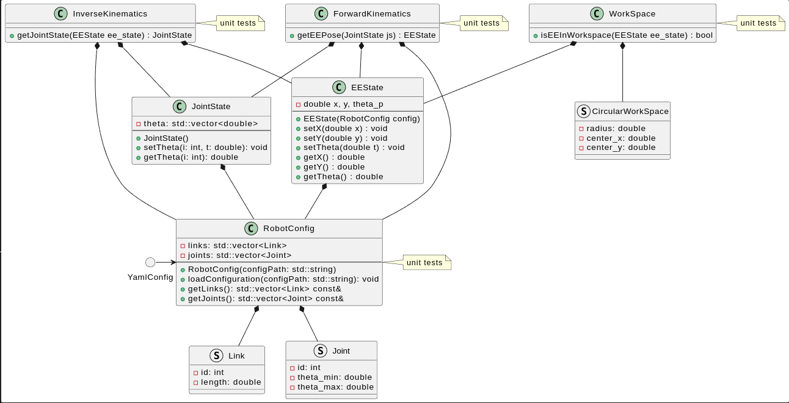

# manipulator_kinematics

## Description
This project is an implementation of the forward and inverse kinematics of a 3R planar manipulator. The forward kinematics is implemented using the Screw Theory and the inverse kinematics is implemented using the Geometric method.

## Software Architecture


## Doxygen Documentation
To generate the doxygen documentation:
Install doxygen
```bash
sudo apt-get install doxygen

# Generate the documentation
# In the project root directory, run the following command:
mkdir docs
cmake --build build/ --target docs

# To view
xdg-open docs/html/index.html
```

## run clang-format
```bash
# In the project root directory, run the following command:
clang-format -i --style=Google $(find . -name *.cpp -o -name *.hpp | grep -vE -e "^./build/")
```